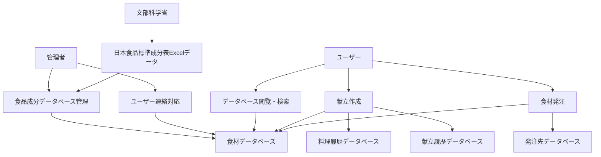
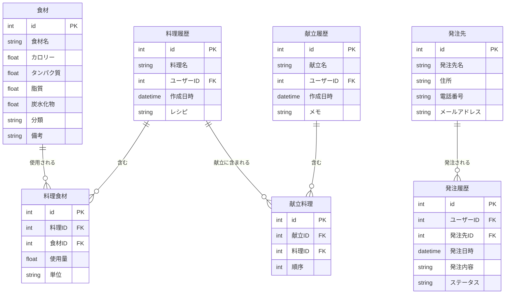
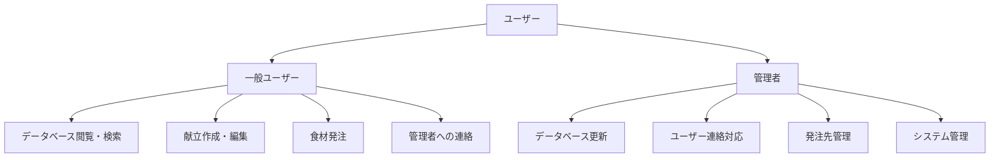
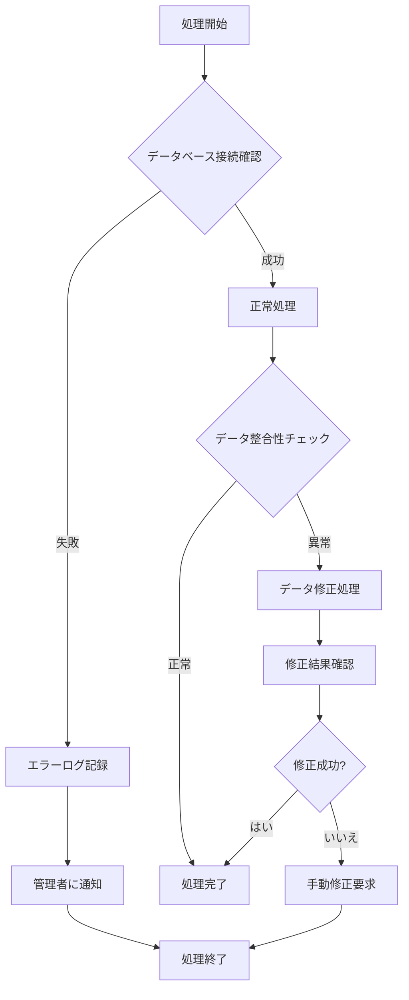
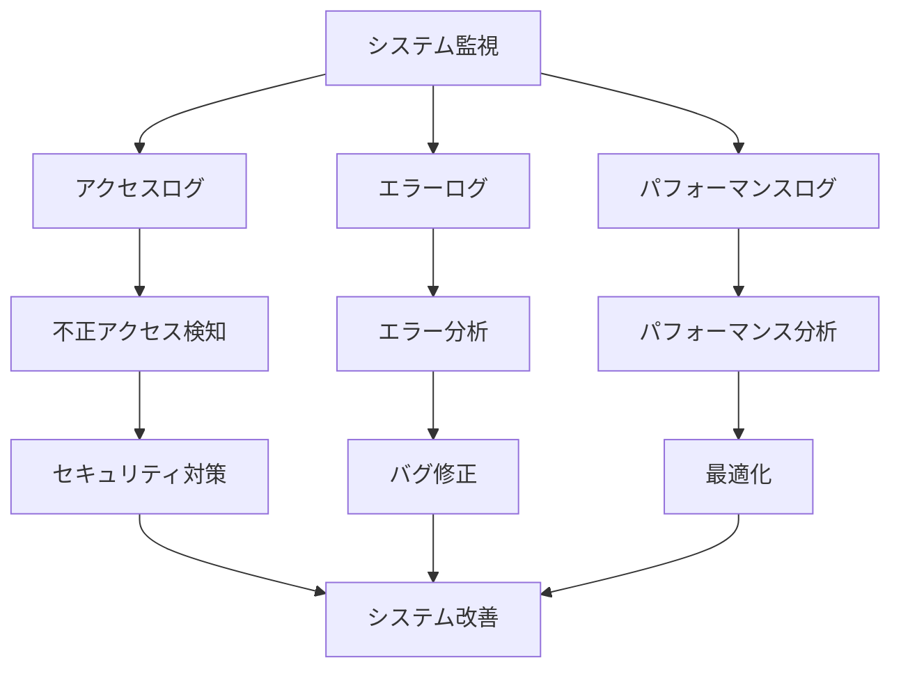

# 食品成分データベースシステム 業務フロー図

## 1. 食品成分データベースの更新フロー

```mermaid
flowchart TD
    A[管理者] --> B[文部科学省の日本食品標準成分表2015年版（七訂）からExcelデータをダウンロード]
    B --> C[ダウンロードしたExcelデータをデータベース(食材)に投入]
    C --> D[ユーザーがデータベースの内容を閲覧・検索]
    D --> E{ユーザーが不足・誤りを発見?}
    E -->|はい| F[ユーザーが管理者に連絡]
    E -->|いいえ| D
    F --> G[管理者が連絡内容を確認]
    G --> H{連絡内容は正しい?}
    H -->|はい| I[データベース(食材)を修正]
    H -->|いいえ| J[ユーザーに説明]
    I --> D
    J --> D
    
    K[文部科学省の日本食品標準成分表が改定] --> L[新しくExcelデータを取得]
    L --> C
```

## 2. 献立の作成フロー

```mermaid
flowchart TD
    A[ユーザー] --> B[料理を作成]
    B --> C[データベース(料理履歴)に登録]
    C --> D[作成した料理に必要な食材をデータベース(食材)から選択]
    D --> E[1回の食事で複数の料理を献立として作成]
    E --> F[データベース(献立履歴)に登録]
    F --> G[メニューごと、献立ごとに必要な食材とカロリーを確認]
    G --> H[作成した献立・料理を履歴として呼び出し]
    H --> I{食材を変更する?}
    I -->|はい| J[履歴の食材を変更]
    I -->|いいえ| K[献立完了]
    J --> K
```

## 3. 食材の発注フロー

```mermaid
flowchart TD
    A[ユーザー] --> B[献立に必要な食材について発注]
    B --> C[作成する人数を入力]
    C --> D[必要な食材数を把握]
    D --> E{データベース(発注先)に発注先が存在?}
    E -->|はい| F[発注先を選択]
    E -->|いいえ| G[発注先を作成]
    G --> F
    F --> H[発注先に食材と食材数をセット]
    H --> I[発注書を作成]
    I --> J[発注書を印刷]
    J --> K[発注完了]
```

## 4. システム全体の統合フロー



## 5. データベース構造



## 6. ユーザー権限とアクセス制御



## 7. エラーハンドリングと例外処理



## 8. システム監視とログ管理

